# Scientific Converters

| Android | iOS | JVM | JS | WasmJS | macOS | tvOS | watchOS |
|:-:|:-:|:-:|:-:|:-:|:-:|:-:|:-:|
| ✅ | ✅ | ✅ | ✅ | ✅ | ✅ | ✅ | ✅ |

This Extension of the Scientific Library for Kaluga contains methods for combining Scientific values into new values.

## Installing
This library is available on Maven Central. You can import Kaluga Scientific as follows:

```kotlin
repositories {
    // ...
    mavenCentral()
}
// ...
dependencies {
    // ...
    implementation("com.splendo.kaluga.scientific:converters:$kalugaVersion")
}
```

## Usage

Units may be multiplied or divided by other units depending on how they are defined. For instance, you can create a Force value by multiplying a `Weight` and `Acceleration` unit. The unit of the returned ScientificValue will be determined based on the input. Calculating with values in the Imperial system generally returns an imperial unit, while using CGS-units will usually return a CGS unit. Alternatively the unit can be explicitly defined by using the creation method (usually named after the `PhysicalQuantity`).

```kotlin
val weight = 10(Kilogram)
val acceleration = 3(Meter per Second per Second)
val force = weight * acceleration // Returns in Newton
val dyneForce = weight.convert(Gram) * acceleration.convert(Centimeter per Second per Second) // Returns in Dyne
val poundForce = PoundForce.force(weight, acceleration) // Returns in PoundForce even though constructing units are in metric
```

For custom Scientific units, currently no operators exist due to compiler limitations. 
These units can be converted through the usages of one of the `multipliedBy`/`dividedBy` methods. 
To get properly simplified results, ensure that the right method is called. E.g. a custom multiplicationUnit multiplied by a dividing unit containing its left value as a numerator would be called using:

`com.splendo.kaluga.scientific.converter.undefined.multiplying.multipliedByDividingUnitWithLeftAsNumerator`

<!-- BEGIN GENERATED CONVERSION DIAGRAMS -->

## Conversion diagrams

For each `PhysicalQuantity`, a diagram shows which quantities it converts to by multiplying (`×`) or dividing (`÷`) by another quantity (shown on the edge), plus reinterpret/reciprocal bridges (dotted).

<details>
<summary><code>AbsorbedDoseRate</code></summary>


</details>

<details>
<summary><code>Acceleration</code></summary>

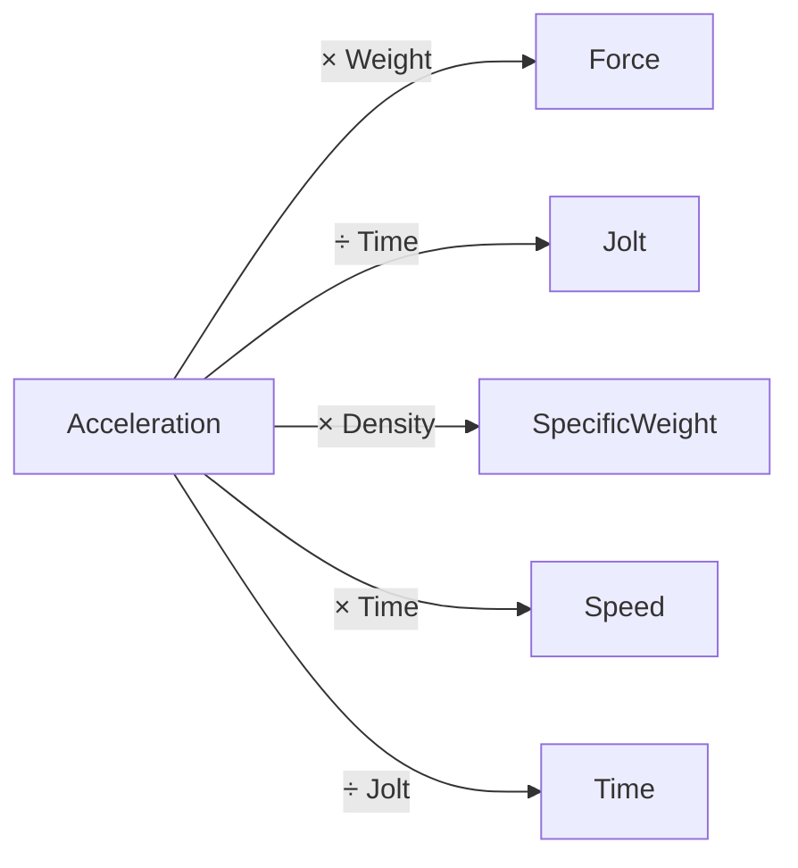

</details>

<details>
<summary><code>Action</code></summary>

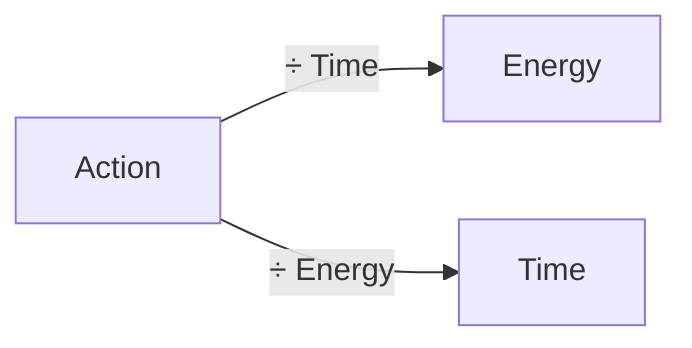

</details>

<details>
<summary><code>AmountOfSubstance</code></summary>

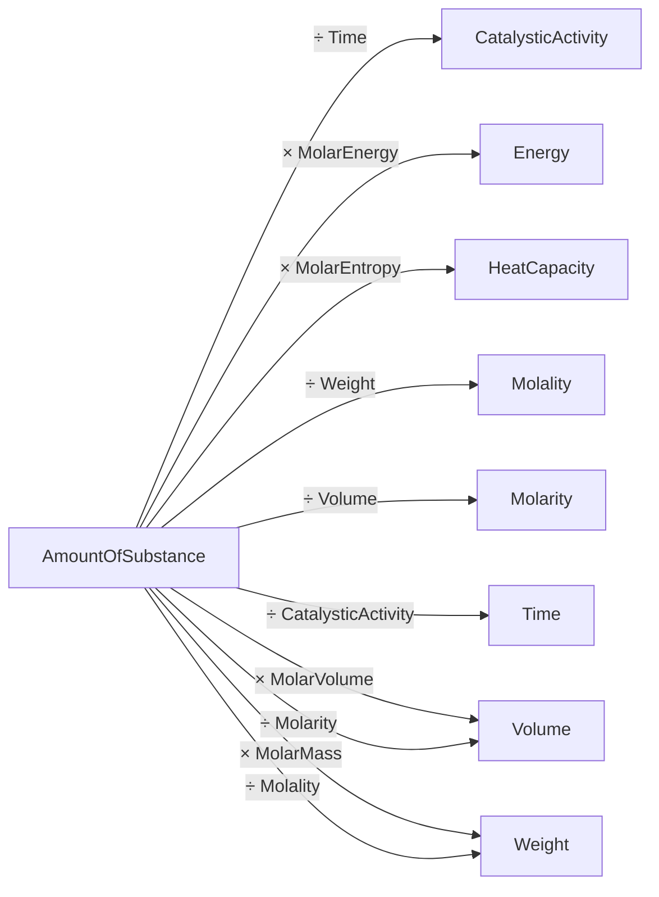

</details>

<details>
<summary><code>Angle</code></summary>

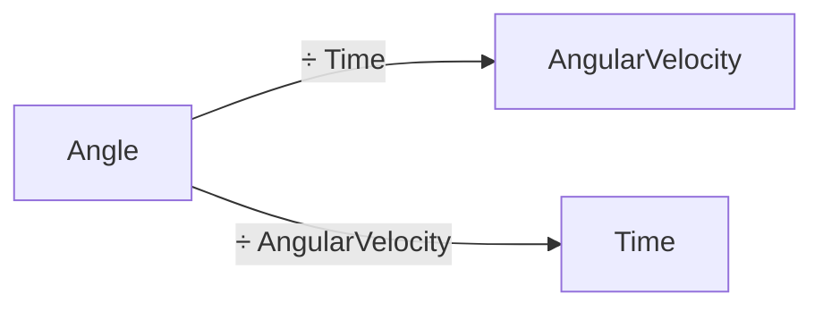

</details>

<details>
<summary><code>AngularAcceleration</code></summary>

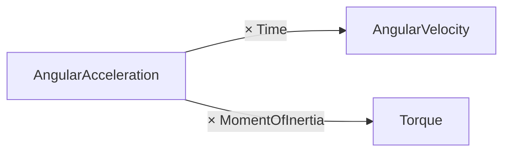

</details>

<details>
<summary><code>AngularVelocity</code></summary>

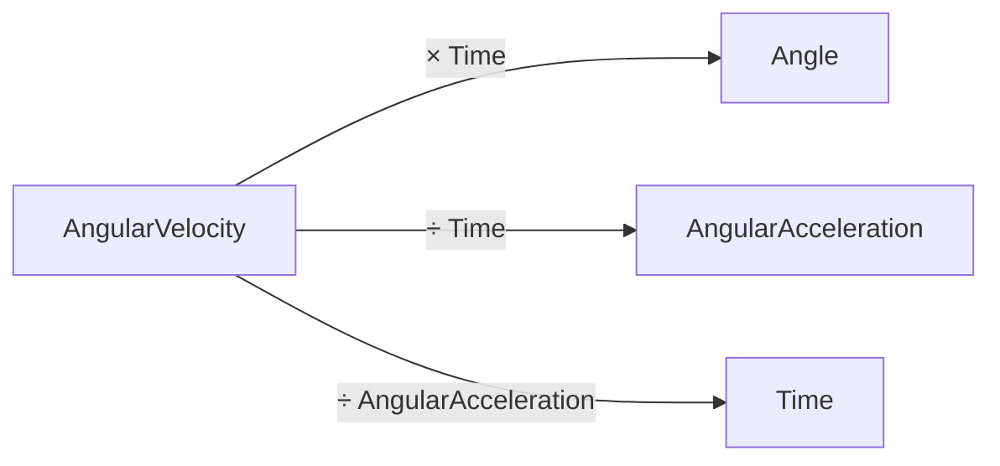

</details>

<details>
<summary><code>Area</code></summary>

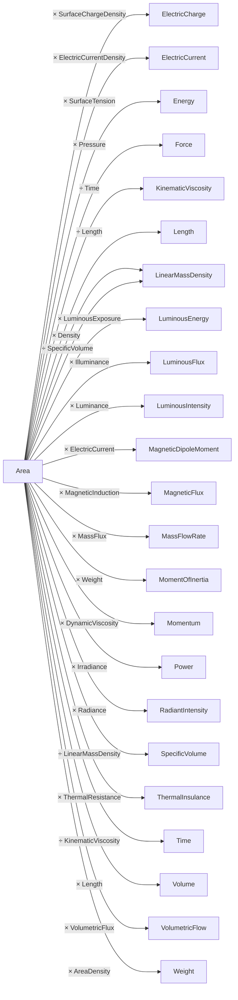

</details>

<details>
<summary><code>AreaDensity</code></summary>

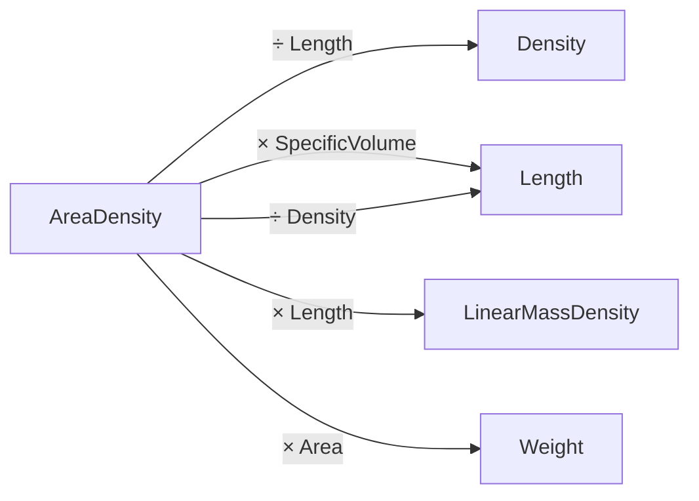

</details>

<details>
<summary><code>CatalysticActivity</code></summary>

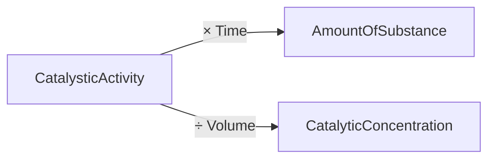

</details>

<details>
<summary><code>CatalyticConcentration</code></summary>


</details>

<details>
<summary><code>Decimal</code></summary>

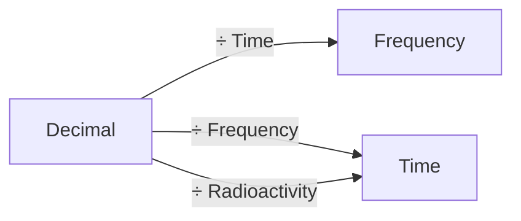

</details>

<details>
<summary><code>Density</code></summary>

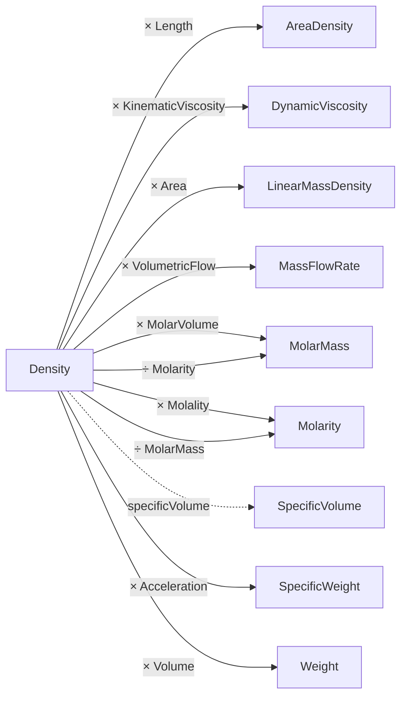

</details>

<details>
<summary><code>Dimensionless</code></summary>


</details>

<details>
<summary><code>DynamicViscosity</code></summary>

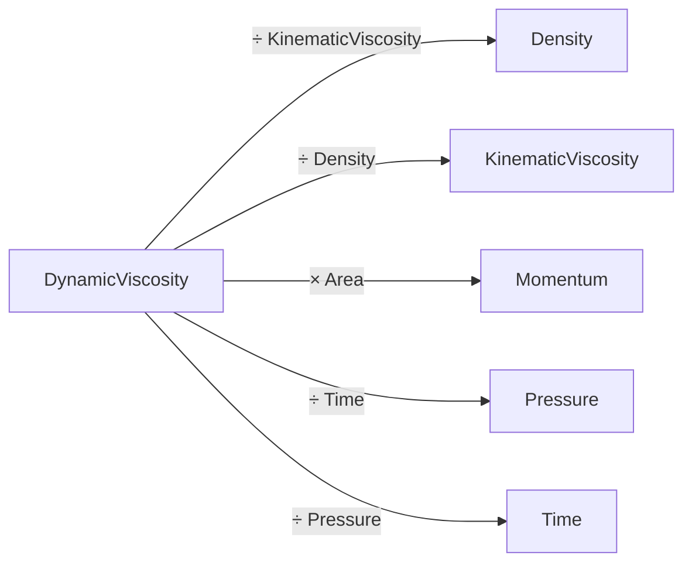

</details>

<details>
<summary><code>ElectricCapacitance</code></summary>

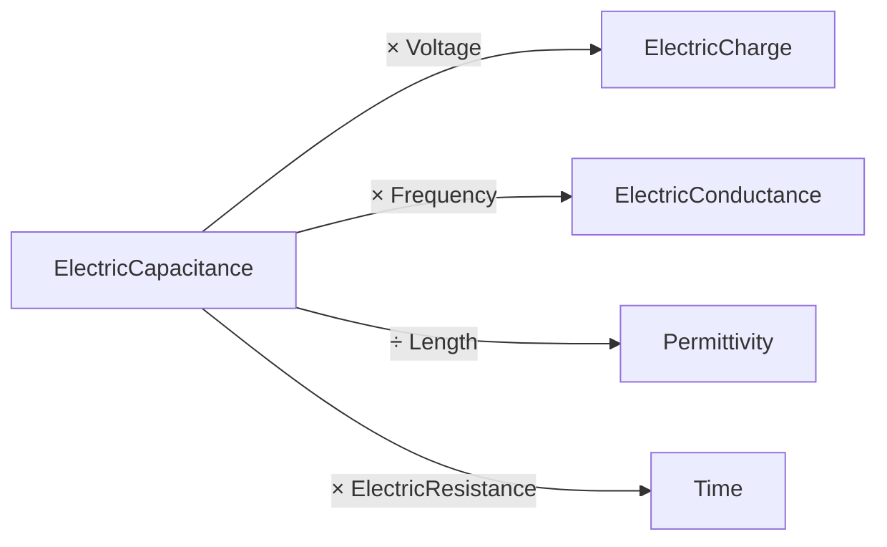

</details>

<details>
<summary><code>ElectricCharge</code></summary>

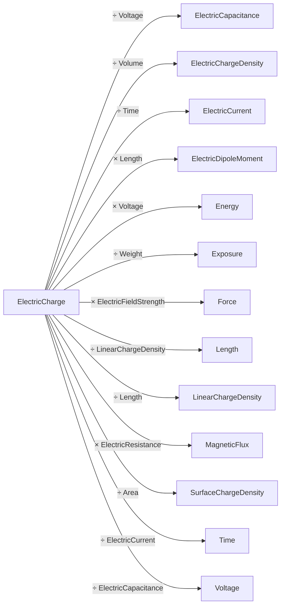

</details>

<details>
<summary><code>ElectricChargeDensity</code></summary>

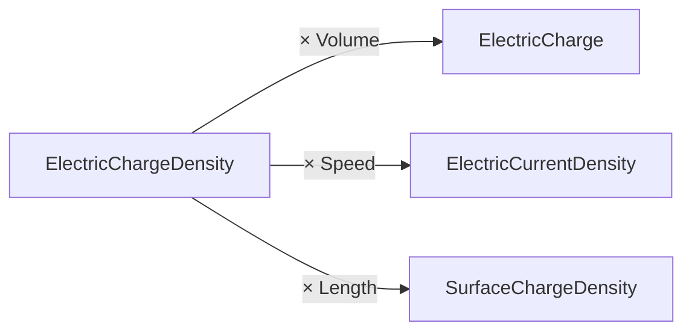

</details>

<details>
<summary><code>ElectricConductance</code></summary>

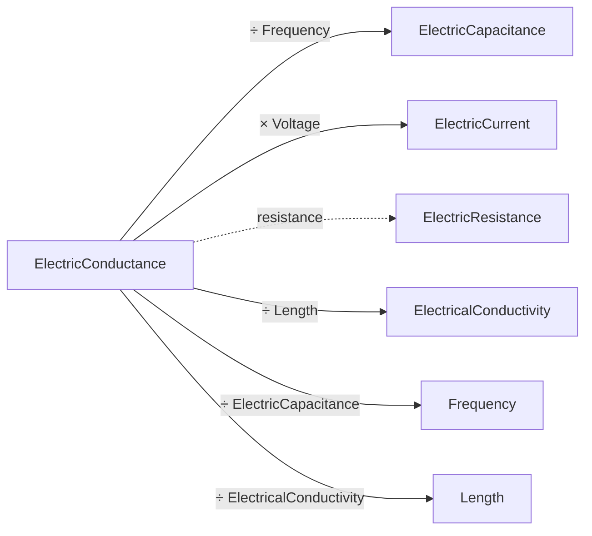

</details>

<details>
<summary><code>ElectricCurrent</code></summary>

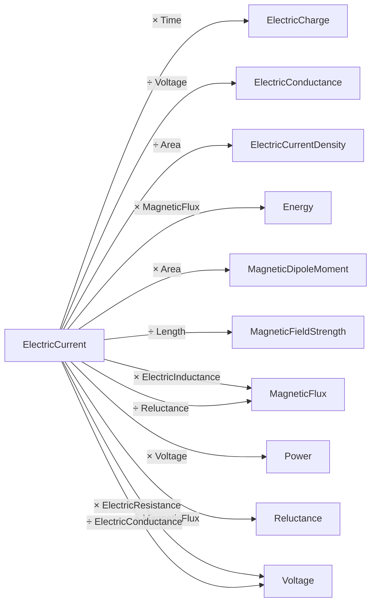

</details>

<details>
<summary><code>ElectricCurrentDensity</code></summary>

```mermaid
graph LR
  ElectricCurrentDensity -->|"÷ Speed"| ElectricChargeDensity
  ElectricCurrentDensity -->|"× Area"| ElectricCurrent
  ElectricCurrentDensity -->|"× Resistivity"| ElectricFieldStrength
  ElectricCurrentDensity -->|"÷ SurfaceChargeDensity"| Frequency
  ElectricCurrentDensity -->|"× Length"| MagneticFieldStrength
  ElectricCurrentDensity -->|"÷ ElectricChargeDensity"| Speed
  ElectricCurrentDensity -->|"× Time"| SurfaceChargeDensity
  ElectricCurrentDensity -->|"÷ Frequency"| SurfaceChargeDensity
```

</details>

<details>
<summary><code>ElectricDipoleMoment</code></summary>

```mermaid
graph LR
  ElectricDipoleMoment -->|"÷ Length"| ElectricCharge
  ElectricDipoleMoment -->|"÷ ElectricCharge"| Length
```

</details>

<details>
<summary><code>ElectricFieldStrength</code></summary>

```mermaid
graph LR
  ElectricFieldStrength -->|"× ElectricalConductivity"| ElectricCurrentDensity
  ElectricFieldStrength -->|"× ElectricCharge"| Force
  ElectricFieldStrength -->|"× Permittivity"| SurfaceChargeDensity
  ElectricFieldStrength -->|"× Length"| Voltage
```

</details>

<details>
<summary><code>ElectricInductance</code></summary>

```mermaid
graph LR
  ElectricInductance -->|"× Frequency"| ElectricResistance
  ElectricInductance -->|"÷ Time"| ElectricResistance
  ElectricInductance -->|"× ElectricCurrent"| MagneticFlux
  ElectricInductance -->|"÷ Length"| Permeability
  ElectricInductance -->|"÷ ElectricResistance"| Time
```

</details>

<details>
<summary><code>ElectricResistance</code></summary>

```mermaid
graph LR
  ElectricResistance -.->|"conductance"| ElectricConductance
  ElectricResistance -->|"× Time"| ElectricInductance
  ElectricResistance -->|"÷ Frequency"| ElectricInductance
  ElectricResistance -->|"÷ ElectricInductance"| Frequency
  ElectricResistance -->|"× ElectricCharge"| MagneticFlux
  ElectricResistance -->|"× Length"| Resistivity
  ElectricResistance -->|"× ElectricCapacitance"| Time
  ElectricResistance -->|"× ElectricCurrent"| Voltage
```

</details>

<details>
<summary><code>ElectricalConductivity</code></summary>

```mermaid
graph LR
  ElectricalConductivity -->|"× Length"| ElectricConductance
  ElectricalConductivity -->|"× ElectricFieldStrength"| ElectricCurrentDensity
  ElectricalConductivity -.->|"resistivity"| Resistivity
```

</details>

<details>
<summary><code>Energy</code></summary>

```mermaid
graph LR
  Energy -->|"× Time"| Action
  Energy -->|"÷ MolarEnergy"| AmountOfSubstance
  Energy -->|"÷ SurfaceTension"| Area
  Energy -->|"÷ Voltage"| ElectricCharge
  Energy -->|"÷ MagneticFlux"| ElectricCurrent
  Energy -->|"÷ Length"| Force
  Energy -->|"÷ Temperature"| HeatCapacity
  Energy -->|"÷ Force"| Length
  Energy -->|"÷ ElectricCurrent"| MagneticFlux
  Energy -->|"÷ AmountOfSubstance"| MolarEnergy
  Energy -->|"÷ Time"| Power
  Energy -->|"÷ Volume"| Pressure
  Energy -->|"÷ Weight"| SpecificEnergy
  Energy -->|"÷ Area"| SurfaceTension
  Energy -->|"÷ HeatCapacity"| Temperature
  Energy -->|"÷ Power"| Time
  Energy -.->|"asTorque"| Torque
  Energy -->|"÷ ElectricCharge"| Voltage
  Energy -->|"÷ Pressure"| Volume
  Energy -->|"÷ IonizingRadiationAbsorbedDose"| Weight
  Energy -->|"÷ IonizingRadiationEquivalentDose"| Weight
  Energy -->|"÷ SpecificEnergy"| Weight
```

</details>

<details>
<summary><code>EnergyDensity</code></summary>

```mermaid
graph LR
  EnergyDensity -.->|"asPressure"| Pressure
```

</details>

<details>
<summary><code>EquivalentDoseRate</code></summary>

```mermaid
graph LR
  EquivalentDoseRate -->|"× Time"| IonizingRadiationEquivalentDose
```

</details>

<details>
<summary><code>Exposure</code></summary>

```mermaid
graph LR
  Exposure -->|"× Weight"| ElectricCharge
```

</details>

<details>
<summary><code>Force</code></summary>

```mermaid
graph LR
  Force -->|"÷ Weight"| Acceleration
  Force -->|"÷ Pressure"| Area
  Force -->|"÷ ElectricFieldStrength"| ElectricCharge
  Force -->|"÷ ElectricCharge"| ElectricFieldStrength
  Force -->|"× Length"| Energy
  Force -->|"÷ SurfaceTension"| Length
  Force -->|"× Time"| Momentum
  Force -->|"× Speed"| Power
  Force -->|"÷ Area"| Pressure
  Force -->|"÷ Volume"| SpecificWeight
  Force -->|"÷ Length"| SurfaceTension
  Force -->|"÷ Yank"| Time
  Force -->|"÷ SpecificWeight"| Volume
  Force -->|"÷ Acceleration"| Weight
  Force -->|"÷ Time"| Yank
```

</details>

<details>
<summary><code>Frequency</code></summary>

```mermaid
graph LR
  Frequency -->|"× Time"| Decimal
  Frequency -->|"× ElectricCapacitance"| ElectricConductance
  Frequency -->|"× SurfaceChargeDensity"| ElectricCurrentDensity
  Frequency -->|"× ElectricInductance"| ElectricResistance
  Frequency -.->|"time"| Time
```

</details>

<details>
<summary><code>HeatCapacity</code></summary>

```mermaid
graph LR
  HeatCapacity -->|"÷ MolarEntropy"| AmountOfSubstance
  HeatCapacity -->|"× Temperature"| Energy
  HeatCapacity -->|"÷ AmountOfSubstance"| MolarEntropy
  HeatCapacity -->|"÷ Weight"| SpecificHeatCapacity
  HeatCapacity -->|"÷ SpecificHeatCapacity"| Weight
```

</details>

<details>
<summary><code>Illuminance</code></summary>

```mermaid
graph LR
  Illuminance -->|"÷ SolidAngle"| Luminance
  Illuminance -->|"× Time"| LuminousExposure
  Illuminance -->|"× Area"| LuminousFlux
  Illuminance -->|"÷ Luminance"| SolidAngle
```

</details>

<details>
<summary><code>IonizingRadiationAbsorbedDose</code></summary>

```mermaid
graph LR
  IonizingRadiationAbsorbedDose -->|"÷ Time"| AbsorbedDoseRate
  IonizingRadiationAbsorbedDose -->|"× Weight"| Energy
  IonizingRadiationAbsorbedDose -.->|"asSpecificEnergy"| SpecificEnergy
  IonizingRadiationAbsorbedDose -->|"÷ AbsorbedDoseRate"| Time
```

</details>

<details>
<summary><code>IonizingRadiationEquivalentDose</code></summary>

```mermaid
graph LR
  IonizingRadiationEquivalentDose -->|"× Weight"| Energy
  IonizingRadiationEquivalentDose -->|"÷ Time"| EquivalentDoseRate
  IonizingRadiationEquivalentDose -.->|"asSpecificEnergy"| SpecificEnergy
  IonizingRadiationEquivalentDose -->|"÷ EquivalentDoseRate"| Time
```

</details>

<details>
<summary><code>Irradiance</code></summary>

```mermaid
graph LR
  Irradiance -->|"× Area"| Power
  Irradiance -->|"÷ SolidAngle"| Radiance
```

</details>

<details>
<summary><code>Jolt</code></summary>

```mermaid
graph LR
  Jolt -->|"× Time"| Acceleration
  Jolt -->|"÷ Time"| Snap
  Jolt -->|"÷ Snap"| Time
  Jolt -->|"× Weight"| Yank
```

</details>

<details>
<summary><code>KinematicViscosity</code></summary>

```mermaid
graph LR
  KinematicViscosity -->|"× Time"| Area
  KinematicViscosity -->|"× Density"| DynamicViscosity
  KinematicViscosity -->|"÷ Time"| SpecificEnergy
  KinematicViscosity -->|"÷ SpecificEnergy"| Time
```

</details>

<details>
<summary><code>Length</code></summary>

```mermaid
graph LR
  Length -->|"× Length"| Area
  Length -->|"× Density"| AreaDensity
  Length -->|"÷ SpecificVolume"| AreaDensity
  Length -->|"× Permittivity"| ElectricCapacitance
  Length -->|"× LinearChargeDensity"| ElectricCharge
  Length -->|"× ElectricalConductivity"| ElectricConductance
  Length -->|"× MagneticFieldStrength"| ElectricCurrent
  Length -->|"× ElectricCharge"| ElectricDipoleMoment
  Length -->|"× Permeability"| ElectricInductance
  Length -->|"× Force"| Energy
  Length -->|"× SurfaceTension"| Force
  Length -->|"× AreaDensity"| LinearMassDensity
  Length -->|"× ElectricCurrentDensity"| MagneticFieldStrength
  Length -->|"× ElectricResistance"| Resistivity
  Length -->|"÷ AreaDensity"| SpecificVolume
  Length -->|"÷ Time"| Speed
  Length -->|"× ElectricChargeDensity"| SurfaceChargeDensity
  Length -->|"× ThermalConductivity"| ThermalConductance
  Length -->|"÷ Speed"| Time
  Length -->|"× ElectricFieldStrength"| Voltage
  Length -->|"× Area"| Volume
  Length -->|"× LinearMassDensity"| Weight
```

</details>

<details>
<summary><code>LinearChargeDensity</code></summary>

```mermaid
graph LR
  LinearChargeDensity -->|"× Length"| ElectricCharge
```

</details>

<details>
<summary><code>LinearMassDensity</code></summary>

```mermaid
graph LR
  LinearMassDensity -->|"× SpecificVolume"| Area
  LinearMassDensity -->|"÷ Density"| Area
  LinearMassDensity -->|"÷ Length"| AreaDensity
  LinearMassDensity -->|"÷ Area"| Density
  LinearMassDensity -->|"÷ AreaDensity"| Length
  LinearMassDensity -->|"× Length"| Weight
```

</details>

<details>
<summary><code>Luminance</code></summary>

```mermaid
graph LR
  Luminance -->|"× SolidAngle"| Illuminance
  Luminance -->|"× Area"| LuminousIntensity
```

</details>

<details>
<summary><code>LuminousEnergy</code></summary>

```mermaid
graph LR
  LuminousEnergy -->|"÷ LuminousExposure"| Area
  LuminousEnergy -->|"÷ Area"| LuminousExposure
  LuminousEnergy -->|"÷ Time"| LuminousFlux
  LuminousEnergy -->|"÷ LuminousFlux"| Time
```

</details>

<details>
<summary><code>LuminousExposure</code></summary>

```mermaid
graph LR
  LuminousExposure -->|"÷ Time"| Illuminance
  LuminousExposure -->|"× Area"| LuminousEnergy
  LuminousExposure -->|"÷ Illuminance"| Time
```

</details>

<details>
<summary><code>LuminousFlux</code></summary>

```mermaid
graph LR
  LuminousFlux -->|"÷ Illuminance"| Area
  LuminousFlux -->|"÷ Area"| Illuminance
  LuminousFlux -->|"× Time"| LuminousEnergy
  LuminousFlux -->|"÷ SolidAngle"| LuminousIntensity
  LuminousFlux -->|"÷ LuminousIntensity"| SolidAngle
```

</details>

<details>
<summary><code>LuminousIntensity</code></summary>

```mermaid
graph LR
  LuminousIntensity -->|"÷ Luminance"| Area
  LuminousIntensity -->|"÷ Area"| Luminance
  LuminousIntensity -->|"× SolidAngle"| LuminousFlux
```

</details>

<details>
<summary><code>MagneticDipoleMoment</code></summary>

```mermaid
graph LR
  MagneticDipoleMoment -->|"÷ ElectricCurrent"| Area
  MagneticDipoleMoment -->|"÷ Area"| ElectricCurrent
```

</details>

<details>
<summary><code>MagneticFieldStrength</code></summary>

```mermaid
graph LR
  MagneticFieldStrength -->|"× Length"| ElectricCurrent
  MagneticFieldStrength -->|"÷ Length"| ElectricCurrentDensity
  MagneticFieldStrength -->|"÷ ElectricCurrentDensity"| Length
  MagneticFieldStrength -->|"× Permeability"| MagneticInduction
  MagneticFieldStrength -->|"÷ SurfaceChargeDensity"| Speed
  MagneticFieldStrength -->|"÷ Speed"| SurfaceChargeDensity
```

</details>

<details>
<summary><code>MagneticFlux</code></summary>

```mermaid
graph LR
  MagneticFlux -->|"÷ MagneticInduction"| Area
  MagneticFlux -->|"÷ ElectricResistance"| ElectricCharge
  MagneticFlux -->|"× Reluctance"| ElectricCurrent
  MagneticFlux -->|"÷ ElectricInductance"| ElectricCurrent
  MagneticFlux -->|"÷ ElectricCurrent"| ElectricInductance
  MagneticFlux -->|"÷ ElectricCharge"| ElectricResistance
  MagneticFlux -->|"× ElectricCurrent"| Energy
  MagneticFlux -->|"÷ Area"| MagneticInduction
  MagneticFlux -->|"÷ Voltage"| Time
  MagneticFlux -->|"÷ Time"| Voltage
```

</details>

<details>
<summary><code>MagneticInduction</code></summary>

```mermaid
graph LR
  MagneticInduction -->|"÷ Permeability"| MagneticFieldStrength
  MagneticInduction -->|"× Area"| MagneticFlux
  MagneticInduction -->|"÷ MagneticFieldStrength"| Permeability
```

</details>

<details>
<summary><code>MassFlowRate</code></summary>

```mermaid
graph LR
  MassFlowRate -->|"÷ VolumetricFlow"| Density
  MassFlowRate -->|"÷ Area"| MassFlux
  MassFlowRate -->|"× SpecificEnergy"| Power
  MassFlowRate -->|"÷ Density"| VolumetricFlow
  MassFlowRate -->|"× Time"| Weight
```

</details>

<details>
<summary><code>MassFlux</code></summary>

```mermaid
graph LR
  MassFlux -->|"× Area"| MassFlowRate
```

</details>

<details>
<summary><code>Molality</code></summary>

```mermaid
graph LR
  Molality -->|"× Weight"| AmountOfSubstance
  Molality -.->|"molarMass"| MolarMass
  Molality -->|"× Density"| Molarity
  Molality -->|"÷ SpecificVolume"| Molarity
  Molality -->|"× MolarEnergy"| SpecificEnergy
  Molality -->|"× MolarVolume"| SpecificVolume
  Molality -->|"÷ Molarity"| SpecificVolume
```

</details>

<details>
<summary><code>MolarEnergy</code></summary>

```mermaid
graph LR
  MolarEnergy -->|"× AmountOfSubstance"| Energy
  MolarEnergy -->|"÷ SpecificEnergy"| MolarMass
  MolarEnergy -->|"× Molality"| SpecificEnergy
  MolarEnergy -->|"÷ MolarMass"| SpecificEnergy
```

</details>

<details>
<summary><code>MolarEntropy</code></summary>

```mermaid
graph LR
  MolarEntropy -->|"× AmountOfSubstance"| HeatCapacity
```

</details>

<details>
<summary><code>MolarMass</code></summary>

```mermaid
graph LR
  MolarMass -->|"× Molarity"| Density
  MolarMass -->|"÷ MolarVolume"| Density
  MolarMass -.->|"molality"| Molality
  MolarMass -->|"× SpecificEnergy"| MolarEnergy
  MolarMass -->|"× SpecificVolume"| MolarVolume
  MolarMass -->|"÷ Density"| MolarVolume
  MolarMass -->|"× AmountOfSubstance"| Weight
```

</details>

<details>
<summary><code>MolarVolume</code></summary>

```mermaid
graph LR
  MolarVolume -->|"× Density"| MolarMass
  MolarVolume -->|"÷ SpecificVolume"| MolarMass
  MolarVolume -.->|"molarity"| Molarity
  MolarVolume -->|"× Molality"| SpecificVolume
  MolarVolume -->|"÷ MolarMass"| SpecificVolume
  MolarVolume -->|"× AmountOfSubstance"| Volume
```

</details>

<details>
<summary><code>Molarity</code></summary>

```mermaid
graph LR
  Molarity -->|"× Volume"| AmountOfSubstance
  Molarity -->|"× MolarMass"| Density
  Molarity -->|"÷ Molality"| Density
  Molarity -->|"× SpecificVolume"| Molality
  Molarity -->|"÷ Density"| Molality
  Molarity -.->|"molarVolume"| MolarVolume
```

</details>

<details>
<summary><code>MomentOfInertia</code></summary>

```mermaid
graph LR
  MomentOfInertia -->|"÷ Weight"| Area
  MomentOfInertia -->|"× AngularAcceleration"| Torque
  MomentOfInertia -->|"÷ Area"| Weight
```

</details>

<details>
<summary><code>Momentum</code></summary>

```mermaid
graph LR
  Momentum -->|"÷ DynamicViscosity"| Area
  Momentum -->|"÷ Area"| DynamicViscosity
  Momentum -->|"÷ Time"| Force
  Momentum -->|"÷ Weight"| Speed
  Momentum -->|"÷ Speed"| Weight
```

</details>

<details>
<summary><code>Permeability</code></summary>

```mermaid
graph LR
  Permeability -->|"× Length"| ElectricInductance
  Permeability -->|"× MagneticFieldStrength"| MagneticInduction
```

</details>

<details>
<summary><code>Permittivity</code></summary>

```mermaid
graph LR
  Permittivity -->|"× Length"| ElectricCapacitance
  Permittivity -->|"× ElectricFieldStrength"| SurfaceChargeDensity
```

</details>

<details>
<summary><code>Power</code></summary>

```mermaid
graph LR
  Power -->|"÷ Voltage"| ElectricCurrent
  Power -->|"× Time"| Energy
  Power -->|"÷ Speed"| Force
  Power -->|"÷ Area"| Irradiance
  Power -->|"÷ SpecificEnergy"| MassFlowRate
  Power -->|"÷ VolumetricFlow"| Pressure
  Power -->|"÷ SolidAngle"| RadiantIntensity
  Power -->|"÷ MassFlowRate"| SpecificEnergy
  Power -->|"÷ Force"| Speed
  Power -->|"× ThermalResistance"| Temperature
  Power -->|"÷ ThermalConductance"| Temperature
  Power -->|"÷ Temperature"| ThermalConductance
  Power -->|"÷ ElectricCurrent"| Voltage
  Power -->|"÷ Pressure"| VolumetricFlow
```

</details>

<details>
<summary><code>Pressure</code></summary>

```mermaid
graph LR
  Pressure -->|"× Time"| DynamicViscosity
  Pressure -->|"× Volume"| Energy
  Pressure -.->|"asEnergyDensity"| EnergyDensity
  Pressure -->|"× Area"| Force
  Pressure -->|"× VolumetricFlow"| Power
```

</details>

<details>
<summary><code>Radiance</code></summary>

```mermaid
graph LR
  Radiance -->|"× SolidAngle"| Irradiance
  Radiance -->|"× Area"| RadiantIntensity
```

</details>

<details>
<summary><code>RadiantIntensity</code></summary>

```mermaid
graph LR
  RadiantIntensity -->|"× SolidAngle"| Power
  RadiantIntensity -->|"÷ Area"| Radiance
```

</details>

<details>
<summary><code>Radioactivity</code></summary>

```mermaid
graph LR
  Radioactivity -->|"× Time"| Decimal
```

</details>

<details>
<summary><code>Reluctance</code></summary>

```mermaid
graph LR
  Reluctance -->|"× MagneticFlux"| ElectricCurrent
```

</details>

<details>
<summary><code>Resistivity</code></summary>

```mermaid
graph LR
  Resistivity -->|"× ElectricCurrentDensity"| ElectricFieldStrength
  Resistivity -->|"÷ Length"| ElectricResistance
  Resistivity -.->|"electricalConductivity"| ElectricalConductivity
  Resistivity -->|"÷ ElectricResistance"| Length
```

</details>

<details>
<summary><code>Snap</code></summary>

```mermaid
graph LR
  Snap -->|"× Time"| Jolt
```

</details>

<details>
<summary><code>SolidAngle</code></summary>

```mermaid
graph LR
  SolidAngle -->|"× Luminance"| Illuminance
  SolidAngle -->|"× Radiance"| Irradiance
  SolidAngle -->|"× LuminousIntensity"| LuminousFlux
  SolidAngle -->|"× RadiantIntensity"| Power
```

</details>

<details>
<summary><code>SpecificEnergy</code></summary>

```mermaid
graph LR
  SpecificEnergy -->|"× Weight"| Energy
  SpecificEnergy -.->|"asAbsorbedDose"| IonizingRadiationAbsorbedDose
  SpecificEnergy -.->|"asEquivalentDose"| IonizingRadiationEquivalentDose
  SpecificEnergy -->|"× Time"| KinematicViscosity
  SpecificEnergy -->|"÷ MolarEnergy"| Molality
  SpecificEnergy -->|"× MolarMass"| MolarEnergy
  SpecificEnergy -->|"÷ Molality"| MolarEnergy
  SpecificEnergy -->|"× MassFlowRate"| Power
  SpecificEnergy -->|"÷ Temperature"| SpecificHeatCapacity
  SpecificEnergy -->|"÷ SpecificHeatCapacity"| Temperature
```

</details>

<details>
<summary><code>SpecificHeatCapacity</code></summary>

```mermaid
graph LR
  SpecificHeatCapacity -->|"× Weight"| HeatCapacity
  SpecificHeatCapacity -->|"× Temperature"| SpecificEnergy
```

</details>

<details>
<summary><code>SpecificVolume</code></summary>

```mermaid
graph LR
  SpecificVolume -->|"× LinearMassDensity"| Area
  SpecificVolume -.->|"density"| Density
  SpecificVolume -->|"× AreaDensity"| Length
  SpecificVolume -->|"× Molarity"| Molality
  SpecificVolume -->|"÷ MolarVolume"| Molality
  SpecificVolume -->|"× MolarMass"| MolarVolume
  SpecificVolume -->|"÷ Molality"| MolarVolume
  SpecificVolume -->|"× Weight"| Volume
```

</details>

<details>
<summary><code>SpecificWeight</code></summary>

```mermaid
graph LR
  SpecificWeight -->|"× Volume"| Force
```

</details>

<details>
<summary><code>Speed</code></summary>

```mermaid
graph LR
  Speed -->|"÷ Time"| Acceleration
  Speed -->|"× ElectricChargeDensity"| ElectricCurrentDensity
  Speed -->|"× Time"| Length
  Speed -->|"× SurfaceChargeDensity"| MagneticFieldStrength
  Speed -->|"× Weight"| Momentum
  Speed -->|"× Force"| Power
  Speed -->|"÷ Acceleration"| Time
```

</details>

<details>
<summary><code>SurfaceChargeDensity</code></summary>

```mermaid
graph LR
  SurfaceChargeDensity -->|"× Area"| ElectricCharge
  SurfaceChargeDensity -->|"÷ Length"| ElectricChargeDensity
  SurfaceChargeDensity -->|"× Frequency"| ElectricCurrentDensity
  SurfaceChargeDensity -->|"÷ Time"| ElectricCurrentDensity
  SurfaceChargeDensity -->|"÷ Permittivity"| ElectricFieldStrength
  SurfaceChargeDensity -->|"÷ ElectricChargeDensity"| Length
  SurfaceChargeDensity -->|"× Speed"| MagneticFieldStrength
  SurfaceChargeDensity -->|"÷ ElectricFieldStrength"| Permittivity
  SurfaceChargeDensity -->|"÷ ElectricCurrentDensity"| Time
```

</details>

<details>
<summary><code>SurfaceTension</code></summary>

```mermaid
graph LR
  SurfaceTension -->|"× Area"| Energy
  SurfaceTension -->|"× Length"| Force
```

</details>

<details>
<summary><code>Temperature</code></summary>

```mermaid
graph LR
  Temperature -->|"× HeatCapacity"| Energy
  Temperature -->|"÷ ThermalResistance"| Power
  Temperature -->|"× SpecificHeatCapacity"| SpecificEnergy
  Temperature -->|"÷ Power"| ThermalResistance
```

</details>

<details>
<summary><code>ThermalConductance</code></summary>

```mermaid
graph LR
  ThermalConductance -->|"÷ ThermalConductivity"| Length
  ThermalConductance -->|"× Temperature"| Power
  ThermalConductance -->|"÷ Length"| ThermalConductivity
  ThermalConductance -.->|"thermalResistance"| ThermalResistance
```

</details>

<details>
<summary><code>ThermalConductivity</code></summary>

```mermaid
graph LR
  ThermalConductivity -->|"× Length"| ThermalConductance
```

</details>

<details>
<summary><code>ThermalInsulance</code></summary>

```mermaid
graph LR
  ThermalInsulance -->|"÷ ThermalResistance"| Area
  ThermalInsulance -->|"÷ Area"| ThermalResistance
```

</details>

<details>
<summary><code>ThermalResistance</code></summary>

```mermaid
graph LR
  ThermalResistance -->|"× Power"| Temperature
  ThermalResistance -.->|"thermalConductance"| ThermalConductance
  ThermalResistance -->|"× Area"| ThermalInsulance
```

</details>

<details>
<summary><code>Time</code></summary>

```mermaid
graph LR
  Time -->|"× Jolt"| Acceleration
  Time -->|"× Energy"| Action
  Time -->|"× CatalysticActivity"| AmountOfSubstance
  Time -->|"× AngularVelocity"| Angle
  Time -->|"× AngularAcceleration"| AngularVelocity
  Time -->|"× KinematicViscosity"| Area
  Time -->|"× Frequency"| Decimal
  Time -->|"× Radioactivity"| Decimal
  Time -->|"× Pressure"| DynamicViscosity
  Time -->|"÷ ElectricResistance"| ElectricCapacitance
  Time -->|"× ElectricCurrent"| ElectricCharge
  Time -->|"× ElectricResistance"| ElectricInductance
  Time -->|"÷ ElectricCapacitance"| ElectricResistance
  Time -->|"× Power"| Energy
  Time -->|"× Yank"| Force
  Time -.->|"frequency"| Frequency
  Time -->|"× AbsorbedDoseRate"| IonizingRadiationAbsorbedDose
  Time -->|"× EquivalentDoseRate"| IonizingRadiationEquivalentDose
  Time -->|"× Snap"| Jolt
  Time -->|"× SpecificEnergy"| KinematicViscosity
  Time -->|"× Speed"| Length
  Time -->|"× LuminousFlux"| LuminousEnergy
  Time -->|"× Illuminance"| LuminousExposure
  Time -->|"× Voltage"| MagneticFlux
  Time -->|"× Force"| Momentum
  Time -->|"× Acceleration"| Speed
  Time -->|"× ElectricCurrentDensity"| SurfaceChargeDensity
  Time -->|"× VolumetricFlow"| Volume
  Time -->|"× MassFlowRate"| Weight
```

</details>

<details>
<summary><code>Torque</code></summary>

```mermaid
graph LR
  Torque -.->|"asEnergy"| Energy
```

</details>

<details>
<summary><code>Voltage</code></summary>

```mermaid
graph LR
  Voltage -->|"× ElectricCapacitance"| ElectricCharge
  Voltage -->|"× ElectricConductance"| ElectricCurrent
  Voltage -->|"÷ ElectricResistance"| ElectricCurrent
  Voltage -->|"÷ Length"| ElectricFieldStrength
  Voltage -->|"÷ ElectricCurrent"| ElectricResistance
  Voltage -->|"× ElectricCharge"| Energy
  Voltage -->|"× Time"| MagneticFlux
  Voltage -->|"× ElectricCurrent"| Power
```

</details>

<details>
<summary><code>Volume</code></summary>

```mermaid
graph LR
  Volume -->|"× Molarity"| AmountOfSubstance
  Volume -->|"÷ MolarVolume"| AmountOfSubstance
  Volume -->|"÷ Length"| Area
  Volume -->|"× CatalyticConcentration"| CatalysticActivity
  Volume -->|"× ElectricChargeDensity"| ElectricCharge
  Volume -->|"× Pressure"| Energy
  Volume -->|"× SpecificWeight"| Force
  Volume -->|"÷ Area"| Length
  Volume -->|"÷ AmountOfSubstance"| MolarVolume
  Volume -->|"÷ Weight"| SpecificVolume
  Volume -->|"÷ Time"| VolumetricFlow
  Volume -->|"× Density"| Weight
  Volume -->|"÷ SpecificVolume"| Weight
```

</details>

<details>
<summary><code>VolumetricFlow</code></summary>

```mermaid
graph LR
  VolumetricFlow -->|"÷ VolumetricFlux"| Area
  VolumetricFlow -->|"× Density"| MassFlowRate
  VolumetricFlow -->|"× Pressure"| Power
  VolumetricFlow -->|"× Time"| Volume
  VolumetricFlow -->|"÷ Area"| VolumetricFlux
```

</details>

<details>
<summary><code>VolumetricFlux</code></summary>

```mermaid
graph LR
  VolumetricFlux -->|"× Area"| VolumetricFlow
```

</details>

<details>
<summary><code>Weight</code></summary>

```mermaid
graph LR
  Weight -->|"× Molality"| AmountOfSubstance
  Weight -->|"÷ MolarMass"| AmountOfSubstance
  Weight -->|"÷ AreaDensity"| Area
  Weight -->|"÷ Area"| AreaDensity
  Weight -->|"÷ Volume"| Density
  Weight -->|"× Exposure"| ElectricCharge
  Weight -->|"× IonizingRadiationAbsorbedDose"| Energy
  Weight -->|"× IonizingRadiationEquivalentDose"| Energy
  Weight -->|"× SpecificEnergy"| Energy
  Weight -->|"× Acceleration"| Force
  Weight -->|"× SpecificHeatCapacity"| HeatCapacity
  Weight -->|"÷ LinearMassDensity"| Length
  Weight -->|"÷ Length"| LinearMassDensity
  Weight -->|"÷ Time"| MassFlowRate
  Weight -->|"÷ AmountOfSubstance"| MolarMass
  Weight -->|"× Area"| MomentOfInertia
  Weight -->|"× Speed"| Momentum
  Weight -->|"÷ MassFlowRate"| Time
  Weight -->|"× SpecificVolume"| Volume
  Weight -->|"÷ Density"| Volume
  Weight -->|"× Jolt"| Yank
```

</details>

<details>
<summary><code>Yank</code></summary>

```mermaid
graph LR
  Yank -->|"× Time"| Force
  Yank -->|"÷ Weight"| Jolt
  Yank -->|"÷ Jolt"| Weight
```

</details>

<!-- END GENERATED CONVERSION DIAGRAMS -->
